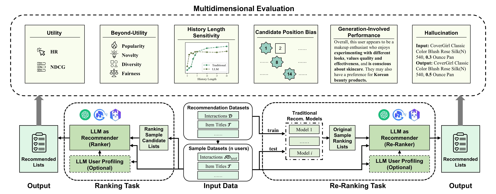

# Multidimensional Evaluation of LLM as Recommender

## Introduction

We propose a multidimensional evaluation framework of LLMs as recommenders, including two conventional dimensions, utility and beyond-utility, and four newly introduced LLM-related dimensions, history length sensitivity, candidate position bias, generation-involved performance and hallucination. Our framework adopts the commonly-used LLM-as-recommender paradigm and considers two specific tasks, ranking and re-ranking, the primary difference of which lies in the formation methods of the candidate sets. Considering the cost, our framework supports evaluation on small sample datasets, with K-S test to ensure the validity of the random sampling. After obtaining the recommendations from the LLM, our evaluation includes six dimensions: two conventional dimensions and four newly proposed dimensions. These four new dimensions focus on the potential new impacts that LLMs might bring to recommendations.

## Key Findings

**Ranking:**

*Observation 1.* Overall, current LLMs are less accurate than traditional models, but they can exhibit greater accuracy in domains where they possess more extensive knowledge.

*Observation 2.* LLMs are adept at recommending more niche items correctly.

*Observation 3.* LLMs require only brief histories to perform well, while longer histories do not always benefit LLMs. LLMs can beat the traditional models in the cold-start scenario.

*Observation 4.* LLMs suffer from a severe candidate position bias, favoring items at the beginning most of the time.

*Observation 5.* LLMs can generate user profiles that capture a majority of the key patterns useful for recommendations, which can help enhance the recommendation interpretability.

*Observation 6.* In general, most LLMs tend to generate below 5\% of non-existent items, while some LLMs significantly hallucinate more items.

**Re-Ranking:**

*Observation 7.* Compared to ranking tasks, LLMs are better at re-ranking tasks regarding utility and beyond.

## Usage

./llm_results: the prompts and results of 5 LLMs on Amazon Beauty and Sports

./eva: core components

- ./eva/templates: templates of different task
- ./eva/codes: instruction construction, LLM as recommender, output parsing, multi-dimensional evaluation

./rechorus: traditional models

./sota_results: results of SOTA models (example)

./data: preprocessed data

- beauty: https://www.dropbox.com/scl/fi/t744vcqf8zmoyjhoj41yl/beauty.zip?rlkey=oojaz38gpjqjhnmrlo33el5b0&st=2wn7qlta&dl=0
- sports: https://www.dropbox.com/scl/fi/uedey8lf34kbv3vzer7no/sports.zip?rlkey=9ekgqctdlp1g1au627cxox2m4&st=e0sosryh&dl=0

./raw_data: raw dataset & dataset proprocessing

- *Amazon Beauty \& Sports (2014)* https://jmcauley.ucsd.edu/data/amazon/index_2014.html
- *MovieLens-1M* https://grouplens.org/datasets/movielens/1m/
- *LastFM* https://grouplens.org/datasets/hetrec-2011/
- Credited to P5